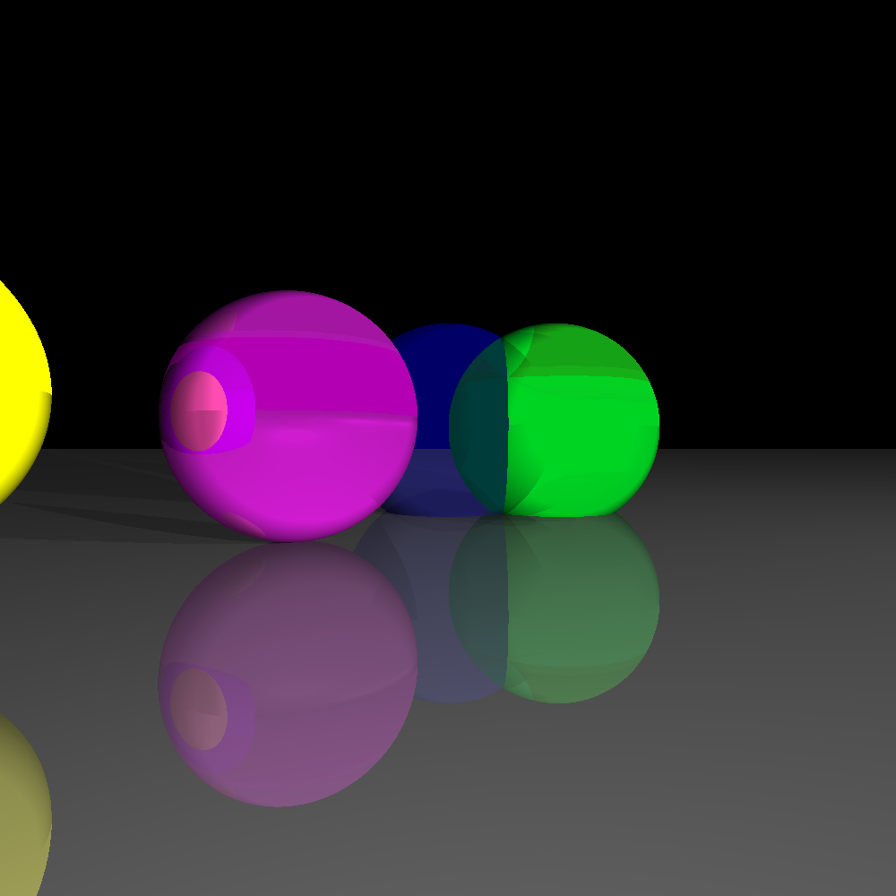
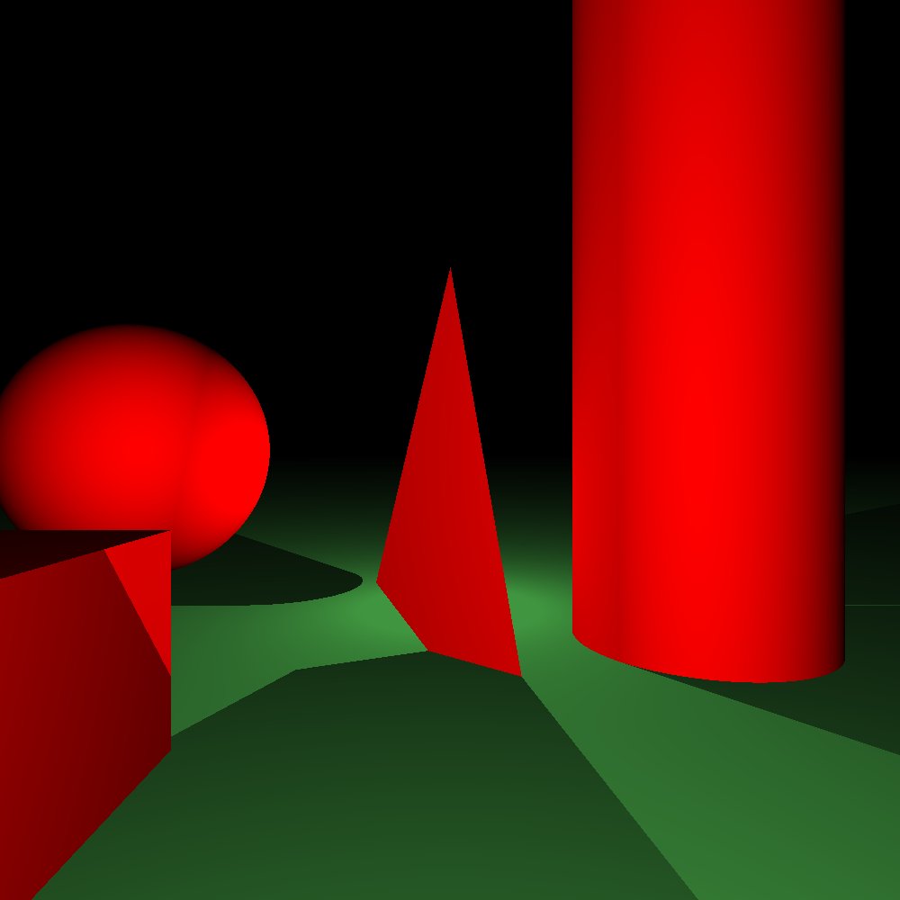
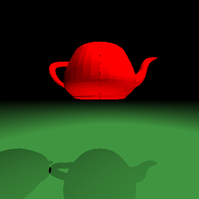
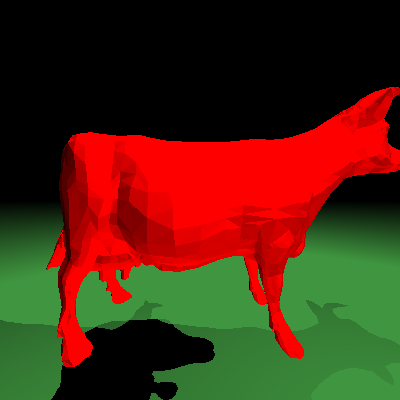

# Raytracer

A program able to generate realistic digital images by simulating the inverse path of light.

## Build

Requires:
- libconfig++ (v1.8.2 recommended)

```sh
make -j`nproc`
```

## Usage

Example scenes are available in the `scenes/` folder.

```sh
./raytracer scenes/bootstrap.cfg > output.ppm
```

## Examples




Object files:

Teapot | Cow
:-------------------------:|:-------------------------:
  |  

## Documentation

Documentation is available in the `docs/` folder.
