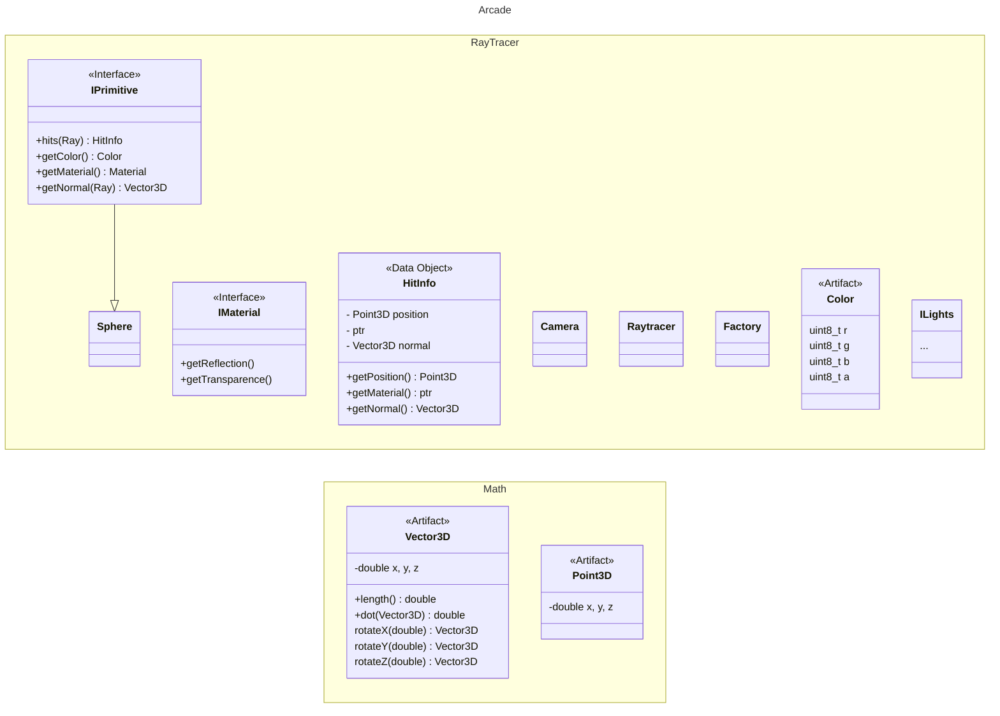

```mermaid
---
title: Arcade
---

classDiagram
    direction LR

    class IPrimitive
    class Sphere

    class IMaterial
    class HitInfo
    class Camera
    class Raytracer
    class Factory
    class Vector3D
    class Point3D

    
    IPrimitive --|> Sphere

    namespace RayTracer {
        class Camera {}
        class Raytracer {}
        class Factory {}
        class Color {
            <<Artifact>>
            uint8_t r
            uint8_t g
            uint8_t b
            uint8_t a
        }
    
        class HitInfo {
            <<Data Object>>
            - Point3D position
            - ptr<IMaterial>
            - Vector3D normal

            +getPosition() Point3D
            +getMaterial() ptr<IMaterial>
            +getNormal() Vector3D
        }


        class IPrimitive {
            <<Interface>>
            +hits(Ray) HitInfo
            +getColor() Color
            +getMaterial() Material
            +getNormal(Ray) Vector3D
        }
        
        class Sphere {}

        class ILights {
            ...
        }

        class IMaterial {
            <<Interface>>
            +getReflection()
            +getTransparence()
        }

    }
    namespace Math {

        class Vector3D {
            <<Artifact>>
            -double x, y, z

            +length() double
            +dot(Vector3D)double
            rotateX(double) Vector3D
            rotateY(double) Vector3D
            rotateZ(double) Vector3D
        }

        class Point3D {
            <<Artifact>>
            -double x, y, z
        }
    }

```
