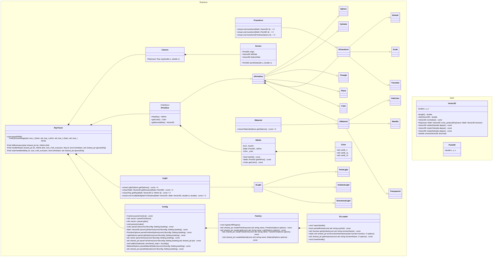

# Architecture

## Class diagram

```mermaid
classDiagram
    namespace Raytracer {
        class Camera {
            +Raytracer::Ray ray(double u, double v)
        }

        class RayTracer {
            +void exportPPM()
            +void processImage(std::size_t yStart, std::size_t yEnd, std::size_t xStart, std::size_t xEnd)

            -Pixel hitIlluminance(std::shared_ptr<IPrimitive> &s, HitInfo &hit)
            -Pixel handleHit(std::shared_ptr<IPrimitive> &s, HitInfo &hit, size_t left_occlusion, Ray &r, bool isAmbiant, std::shared_ptr<IPrimitive> ignoredObj)
            -Pixel mainHandleHit(Ray &r, size_t left_occlusion, bool isAmbiant, std::shared_ptr<IPrimitive> ignoredObj)
        }

        class Config {
            +Camera parseCamera() const
            +std::vector<std::shared_ptr<IPrimitive>> parsePrimitives()
            +std::vector<std::shared_ptr<ILight>> parseLights()
            +void parseIncludes()

            -Color parseColor(const libconfig::Setting &setting) const
            -Math::Vector3D parseCylinderAxis(const libconfig::Setting &setting) const
            -PrimitiveOptions parsePrimitiveOptions(const libconfig::Setting &setting) const
            -LightOptions parseLightOptions(const libconfig::Setting &setting) const
            -std::vector<Math::Point3D> parseVertices(const libconfig::Setting &setting) const
            -std::shared_ptr<ITransform> parseTransform(const libconfig::Setting &setting,std::shared_ptr<ITransform> ptr) const
            -void walkIncludes(std::unordered_map<std::string, std::optional<std::shared_ptr<Config>>> &configs)
            -MaterialOptions parseMaterialOptions(const libconfig::Setting &setting) const
            -std::shared_ptr<IMaterial> parseMaterial(const libconfig::Setting &setting) const
        }

        class Factory {
            +void registerAllPlugins()
            +std::shared_ptr<IPrimitive> createPrimitive(const std::string name, PrimitiveOptions options) const
            +std::shared_ptr<ILight> createLight(const std::string name, LightOptions options) const
            +std::shared_ptr<ITransform> createTransform(const std::string name, TransformOptions options) const
            +std::shared_ptr<IMaterial> createMaterial(const std::string name, MaterialOptions options) const
        }

        class DLLoader {
            +void *openHandle()
            +bool symbolExists(const std::string symbol) const
            +std::function<T *(O)> getSymbol(const std::string functionName) const
            +static std::shared_ptr<T> turnFunctionIntoInstance(std::function<T *(O)> function, O options)
            +std::shared_ptr<T> getInstance(const std::string functionName, O options) const
            +void closeHandle()
        }

        class Color {
            +std::uint8_t r
            +std::uint8_t g
            +std::uint8_t b
        }

        class HitInfo {
            -bool _hasHit
            -Math::Point3D _hitPos
            -Color _color

            +bool hasHit() const
            +Math::Point3D getHitPos() const
            +Color getColor() const
        }


        class IPrimitive {
            <<Interface>>
            +hits(Ray) HitInfo
            +getColor() Color
            +getNormal(Ray) Vector3D
        }

        class APrimitive {}

        class Sphere {}
        class Cylinder {}
        class Triangle {}
        class Plane {}
        class Cube {}

        class ILight {
            +virtual LightOptions getOptions() const = 0
            +virtual Math::Vector3D getDirection(Math::Point3D) const = 0
            +virtual Ray getRay(Math::Vector3D &, HitInfo &) const = 0
            +virtual void modifyMultiplierForShadow(Math::Vector3D, Math::Vector3D, double &, double) const = 0
        }

        class ALight {}

        class AmbientLight {}
        class DirectionalLight {}
        class PointLight {}

        class ITransform {
            +virtual void transform(Math::Vector3D &) = 0
            +virtual void transform(Math::Point3D &) = 0
            +virtual void transform(PrimitiveOptions &) = 0
        }

        class ATransform {}

        class Default {}
        class Scale {}
        class Translate {}

        class IMaterial {
            +virtual MaterialOptions getOptions() const = 0
        }

        class AMaterial {}
        class FlatColor {}
        class Metallic {}
        class Transparent {}

        class Screen {
            +Point3D origin
            +Vector3D leftSide
            +Vector3D bottomSide
            +Point3D pointAt(double u, double v)
        }
    }

    ITransform --|> ATransform
    ATransform --|> Default
    ATransform --|> Scale
    ATransform --|> Translate

    IPrimitive --|> APrimitive
    APrimitive --|> Sphere
    APrimitive --|> Cylinder
    APrimitive --|> Triangle
    APrimitive --|> Plane
    APrimitive --|> Cube
    APrimitive *-- ATransform

    ILight --|> ALight
    ALight --|> PointLight
    ALight --|> AmbientLight
    ALight --|> DirectionalLight

    IMaterial --|> AMaterial
    AMaterial --|> FlatColor
    AMaterial --|> Metallic
    AMaterial --|> Transparent
    APrimitive *-- AMaterial

    Camera *-- Screen
    RayTracer *-- Camera

    RayTracer *-- IPrimitive
    RayTracer *-- ILight
    RayTracer *-- Config
    IPrimitive *-- HitInfo
    HitInfo *-- Color
    Config *-- Factory
    Factory *-- DLLoader

    namespace Math {
        class Vector3D {
            -double x, y, z
            +length() double
            +dot(Vector3D) double
            +Vector3D normalize() const
            +Raytracer::Math::Vector3D cross_product(Raytracer::Math::Vector3D &vector)
            +Vector3D rotateX(double degree) const
            +Vector3D rotateY(double degree) const
            +Vector3D rotateZ(double degree) const
            +double cosine(Vector3D &normal)
        }

        class Point3D {
            -double x, y, z
        }
    }

```
